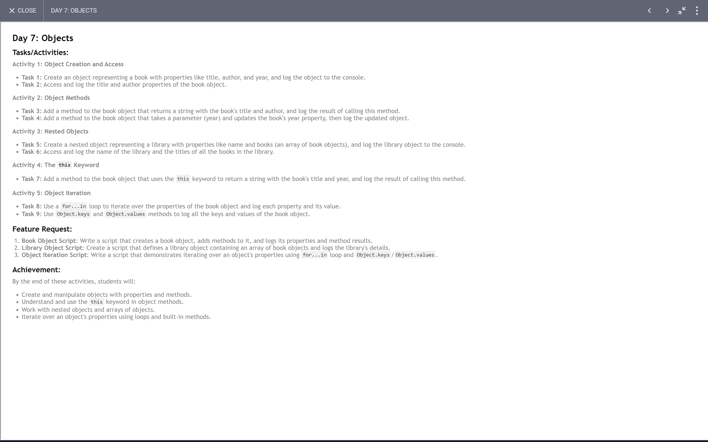

# 30 Days JavaScript Challange
[Day 1: Variables and Data Types](#day-1--variables-and-data-types)<br>
[Day 2: Operators](#day-2--operators)<br>
[Day 3: Control Structure](#day-3-control-structures)<br>
[Day 4: Loop](#day-4-loop)

## Day 1 : Variables and Data Types

*Day 1: Task ScreenShot*


```js
const present=true;
console.log(present);

// type of
console.log(typeof num1);
console.log(typeof city);
console.log(typeof present);

let car={}
console.log(typeof car);

let subjects=[]
console.log(typeof subjects);

let roomNum=56;
roomNum=58;
console.log(roomNum);

const laptop="dell";
laptop="hp";
console.log(laptop);
```

*Output*


- You cannot reassign const variable.It will give error.

[Back To Top](#30-days-javascript-challange)
## Day 2 : Operators


```js
// Arithmetic operators

let a=15;
let b=6;
console.log(a+b);
console.log(a-b);
console.log(a*b);
console.log(a/b);
console.log(a%b);

// Assignment operators
a+=b;
console.log(a);
a-=b;
console.log(a);

// Comparison operators
let c='a';
let d='b';
console.log(c>d);
console.log(c<d);
console.log(c<=d);
console.log(c>=d);
let e=5;
let f='5';
console.log(e==f);
console.log(e===f);

// Logical Operators
console.log(true && true);
console.log(true && false);
console.log(false && true);
console.log(false && false);
console.log(true || true);
console.log(true || false);
console.log(false || true);
console.log(false || false);
console.log(!true)
console.log(true!=false)

// Ternary Operator
let g=10;
let h=20;
console.log(g>h?g:h);
```


[Back To Top](#30-days-javascript-challange)
## Day 3: Control Structures


```js
// Activity 1
// Task 1
let positive = 5;
let negative = -5;
let zero = 0;
if (positive > 0) {
    console.log("Positive: " + positive)
}
else if (negative < 0) {
    console.log("Negative: " + negative)
}
else if (zero == 0) {
    console.log("Zero: " + zero)
}

// Task 2
let age = 25;
if (age >= 18) {
    console.log("You can vote")
}
else {
    console.log("You can't vote")
}

// Activity 2
// Task 3
let num1 = 2;
let num2 = 5;
let num3 = 1;
if (num1 > num2) {
    if (num1 > num3) {
        console.log("The largest number is: " + num1)
    }
    else {
        console.log("The largest number is: " + num3)
    }
}
else {
    if (num2 > num3) {
        console.log("The largest number is: " + num2)
    }
    else {
        console.log("The largest number is: " + num3)
    }
}

// Activity 3
// Task 4

let num = 5;
switch (num) {
    case 1:
        console.log("Sunday")
        break;
    case 2:
        console.log("Monday")
        break;
    case 3:
        console.log("Tuesday")
        break;
    case 4:
        console.log("Wednesday")
        break;
    case 5:
        console.log("Thursday")
        break;
    case 6:
        console.log("Friday")
        break;
    case 7:
        console.log("Saturday")
        break;
    default:
        break;
}

// Task 5
let marks = 85;
switch (marks) {
    case marks >= 90 && marks < 100:
        console.log('Grade: A')
        break;
    case marks >= 80 && marks < 90:
        console.log('Grade: B')
        break;
    case marks >= 70 && marks < 80:
        console.log('Grade: C')
        break;
    case marks >= 60 && marks < 70:
        console.log('Grade: D')
        break;
    case marks >= 50 && marks < 60:
        console.log('Grade: F')
        break;
    default:
        break;
}

// Activity 4
// Task 6
let number = 23;
number % 2 == 0 ? console.log('Even Number') : console.log('Odd Number');

// Activity 5
// Task 7
let year = 2026

if 
(
    year % 4 == 0 &&
    year % 100 != 0 ||
    year % 400 == 0
)
{
    console.log("Leap Year")
}
else
{
    console.log("Not a Leap Year")
}
```


[Back To Top](#30-days-javascript-challange)

## Day 4: Loop


```js
// Activity 1
// Task 1

for(let i=1;i<=10;i++){
    console.log(i);
}

// Task 2

for(let j=1;j<=10;j++){
    console.log("5 x "+j+" = "+5*j);
}

// Activity 2
// Task 3
let sum=0;
let n=10
while(n--){
    sum+=n;
}
console.log(sum);

// Task 4
let a=10;
while(a--){
    console.log(a);
}

// Activity 3
// Task 5
let b=5;
do{
    console.log(b);
}
while(b--);

// Task 6
let factNum=6;
let fact=1;
do{
    fact*=factNum;
    factNum--;
}
while(factNum>0);

// Task 7
for(let i=1;i<=5;i++){
    let stars=""
    for(let j=1;j<=i;j++){
        stars+="*"
    }
    console.log(stars);
}
```
[Back To Top](#30-days-javascript-challange)