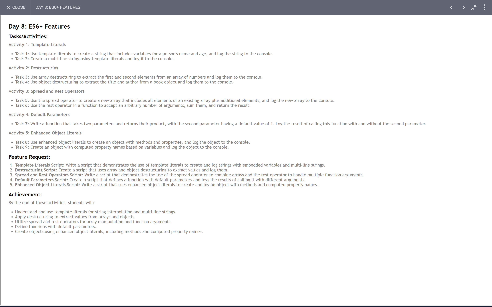

# 30 Days JavaScript Challange
[Day 1: Variables and Data Types](#day-1--variables-and-data-types) 
[Day 2: Operators](#day-2--operators) 
[Day 3: Control Structure](#day-3-control-structures) 
[Day 4: Loop](#day-4-loop) 
[Day 5: Functions](#day-5-functions) 
[Day 6: Arrays](#day-6-arrays) 
[Day 7: Objects](#day-7-objects) 
[Day 8: ES6+ Features](#day-8-es6-features) 
[Day 9: DOM Manipulation](#day-9-dom-manipulation) 
[Day 10: Event Handling](#day-10-event-handling) 
[Day 11: Promises and Async Await](#day-11-promises-and-asyncawait) 
[Day 12: Error Handling](#day-12-error-handling) 
[Day 13: Modules](#day-13-modules) 
[Day 14: Classes](#day-14-classes) 
[Day 15: Closures](#day-15-closures) 
[Day 16: Recursion](#day-15-closures) 
[Day 17: Data Structure](#day-17-data-structures) 
[Day 18: Algorithms](#day-18-algorithms) 
[Day 19: Regular Expressions](#day-19-regular-expressions) 
[Day 20: LocalStorage and Session Storage](#day-20-localstorage-and-session-storage) 
[Day 21: LeetCode Easy](#day-21-leetcode-easy) 
[Day 22: LeetCode Medium](#day-22-leetcode-medium) 
[Day 23: LeetCode Hard](#day-23-leetcode-hard) 

## Day 1 : Variables and Data Types

[Task Solution](/30DayChallange/Day1.js) 

 
[Back To Top](#30-days-javascript-challange)
## Day 2 : Operators
[Task Solution](/30DayChallange/Day2.js) 

[Back To Top](#30-days-javascript-challange)
## Day 3: Control Structures
[Task Solution](/30DayChallange/Day3.js) 

[Back To Top](#30-days-javascript-challange)

## Day 4: Loop
[Task Solution](/30DayChallange/Day4.js) 

[Back To Top](#30-days-javascript-challange)

## Day 5: Functions
[Task Solution](/30DayChallange/Day5.js) 

[Back To Top](#30-days-javascript-challange)

## Day 6: Arrays

[Task Solution](/30DayChallange/Day6.js) 

[Back To Top](#30-days-javascript-challange)

## Day 7: Objects
[Task Solution](/30DayChallange/Day7.js) 

[Back To Top](#30-days-javascript-challange)

## Day 8: ES6+ Features
[Task Solution](/30DayChallange/Day8.js) 

[Back To Top](#30-days-javascript-challange)

## Day 9: Dom Manipulation
[Task Solution](/30DayChallange/Day9/index.html) 

## Day 10: Event Handling
[Task Solution](/30DayChallange/Day10/index.html) 

## Day 11: Promises and Async/Await
[Task Solution](/30DayChallange/Day11/Day11.js) 

[Back To Top](#30-days-javascript-challange)

## Day 12: Error Handling
[Task Solution](/30DayChallange/Day12.js) 

## Day 13: Modules
[Task Solution](/30DayChallange/Day13/Day13.js) 

## Day 14: Classes
[Task Solution](/30DayChallange/Day14.js) 

[Back To Top](#30-days-javascript-challange)

## Day 15: Closures
[Task Solution](/30DayChallange/Day15.js) 

## Day 16: Recursion
[Task Solution](/30DayChallange/Day16.js) 

[Back To Top](#30-days-javascript-challange)
## Day 17: Data Structures
[Task Solution](/30DayChallange/Day17.js) 

## Day 18: Algorithms
[Task Solution](/30DayChallange/Day18.js) 

## Day 19: Regular Expressions
[Task Solution](/30DayChallange/Day19.js) 

## Day 20: LocalStorage and Session Storage

[Task Solution](/30DayChallange/Day20/Task3.html)

[Back To Top](#30-days-javascript-challange) 

## Day 21: LeetCode Easy

## Day 22: LeetCode Medium

## Day 23: LeetCode Hard

[Back To Top](#30-days-javascript-challange)

## Day 24: Weather App
[Task Solution](/30DayChallange/Day24) 

